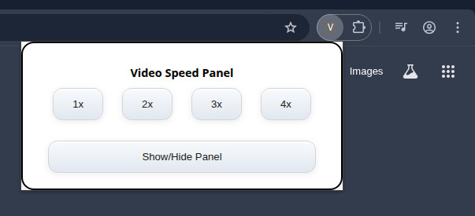

# Copilot Dev Browser Extension Project
This was created with copilot and LLMs

This project provides a browser extension for **Google Chrome only** to help users address common annoyances on websites. All code now lives in the project root for easier maintenance.

## Extension Screenshots

**Extension Popup:**  

**Extension Panel:**  

## Features
- Video Speed Panel: Easily control playback speed for any video element on supported pages (not just YouTube)

This is to avoid having to type 
`document.getElementsByTagName("video")[0].playbackRate=4`

- Popup UI: Speed buttons (1x–4x) are grouped in a row, with the Show/Hide Panel button always on a separate row below
- Button highlighting: The active speed button is highlighted yellow, and updates automatically when you use the panel or keyboard shortcuts
- Keyboard shortcuts for quick speed changes
- Chrome-only support: This extension is designed and tested exclusively for Google Chrome.
- Shared logic for easy maintenance and feature parity

---

## Folder Structure
- All extension files are in the project root (e.g. `manifest.json`, `content.js`, `popup.js`, etc.)

---

## Getting Started

### Chrome Extension (Developer Mode)
1. Open Chrome and go to `chrome://extensions/`
2. Enable **Developer mode** (toggle in the top right)
3. Click **Load unpacked**
4. Select the project root folder (where `manifest.json` is)
5. The extension will appear in your extensions list

**Note:** This extension does not support Firefox. All development and testing is focused on Chrome only.

---

## Customization
- Add more tools or logic in the root directory and update the content scripts as needed for each browser.

## Keyboard Shortcuts
- **Ctrl+Shift+5**: Show/Hide the Video Speed Panel on any supported page.
- **Shift+1** to **Shift+4**: Set video playback speed to 1x, 2x, 3x, or 4x. The panel display updates automatically to reflect the current speed.

---

